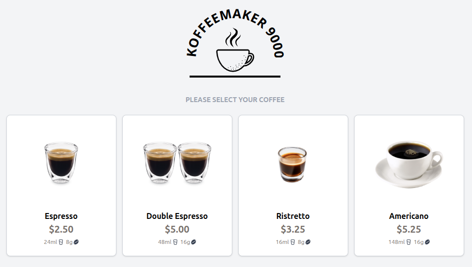

# Koffeemaker 9000



A full-stack web application demonstration built with Laravel (API) and Vue 3 (UI).

This is an implementation of the BlueShore Services [Laravel/Vue Challenge](https://github.com/BlueShores-Services/laravel-vue-challenge).

## 🗂️ Project Structure

```bash
coffeemaker/
├── api/
├── ui/
├── CHALLENGE.md
├── README.md
```

## 🚀 Quick Start

### Prerequisites

- PHP 8.2
- Docker
- Docker Compose
- Node v22 (optional `nvm`)

### Initial Setup

**Backend**:

```bash
cd coffeemaker/api
composer install
cp .env.example .env
vendor/bin/sail up -d
vendor/bin/sail artisan migrate:fresh --seed
vendor/bin/sail artisan storage:link
```

**Frontend**:

```bash
cd coffeemaker/ui
cp .env.example .env
nvm use # optional, if using nvm.
npm install
```

## ⚡ Running the Demo

```bash
cd coffeemaker/api
vendor/bin/sail up -d

cd coffeemaker/ui
npm run dev
```

The backend api is located at `http://localhost/`.

Visit `http://localhost:5714` Koffeemaker application.
