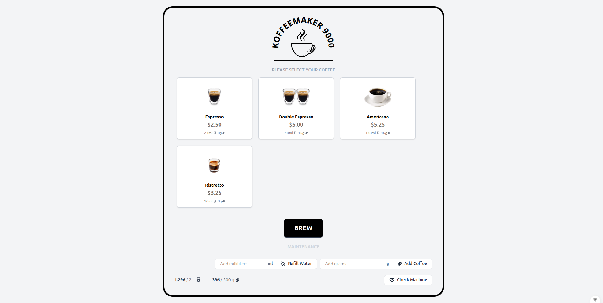

# Koffeemaker 9000



A full-stack web application demonstration built with Laravel (API) and Vue 3 (UI).

This is an implementation of the BlueShore Services [Laravel/Vue Challenge](https://github.com/BlueShores-Services/laravel-vue-challenge).

## 🗂️ Project Structure

```bash
coffeemaker/
├── api/
├── ui/
├── CHALLENGE.md
├── README.md
```

## 🚀 Quick Start

### Prerequisites

- PHP 8.2
- Docker
- Docker Compose
- Node v22 (optional `nvm`)

### Initial Setup

**Backend**:

```bash
cd coffeemaker/api
composer install
cp .env.example .env
vendor/bin/sail up -d
vendor/bin/sail artisan migrate:fresh --seed
vendor/bin/sail artisan storage:link
```

**Frontend**:

```bash
cd coffeemaker/ui
cp .env.example .env
nvm use # optional, if using nvm.
npm install
```

### Assumptions

Some assumptions for the application:

- All prerequisite dependencies are assumed to be installed globally on the host machine.
- While the Challenge file mentions Docker, Laravel Sail was used as a sufficient Docker-based solution.
- Node.js is assumed to be installed globally, as no separate Node container was included.
- Ristretto coffee is not part of the original Challenge specification, though it can be added optionally via seeding.

## ⚡ Running the Demo

A helper script is added to run the two projects:

```bash
chmod +x dev.sh
./dev.sh
```

This will run an equivalent of:

```bash
cd coffeemaker/api
vendor/bin/sail up -d

cd coffeemaker/ui
npm run dev
```

The backend api is located at `http://localhost/`.

Visit `http://localhost:5714` Koffeemaker application.

## ☕  Data Population

> [!NOTE] 
> Default data should have been populated when running the `sail artisan migrate:fresh --seed` command from above.

### Coffee

If you encounter the page with no coffee, it is probably due to not running the seeder:

```bash
cd coffeemaker/api
sail artisan db:seed
```

This should add three coffee varieties and a coffee machine.

**Ristretto Coffee**

To add a Ristretto coffee (mentioned in the Challenge file), run the seeder:

```bash
sail artisan db:seed CoffeeRistrettoSeeder
```

**Random Coffee**

To add a random fake coffee, run the seeder:

```bash
sail artisan db:seed CoffeeRandomSeeder
```

### Machine

By default, when running the `migrate` command with seeds, the application will install a random `Machine` resource.
The water and coffee capacity is pulled from `.env` file, otherwise default values from the Challenge file are used.

```dotenv
COFFEE_MACHINE_WATER_CAPACITY=2000.0
COFFEE_MACHINE_WATER_REMAINING=2000.0
COFFEE_MACHINE_COFFEE_CAPACITY=500.0
COFFEE_MACHINE_COFFEE_REMAINING=500.0
```

For this demonstration, only the first machine is ever used.

## 🧪 Running Tests

Some test coverage has been added for the Container classes and API endpoints.

```bash
sail artisan test
```

### Postman Documentation

A Postman Collection of endpoints can be imported from [docs/Coffee API Collection.postman_collection.json](docs/Coffee%20API%20Collection.postman_collection.json) file.

## Conclusion

Please reach out to me if you have trouble setting up the project locally.